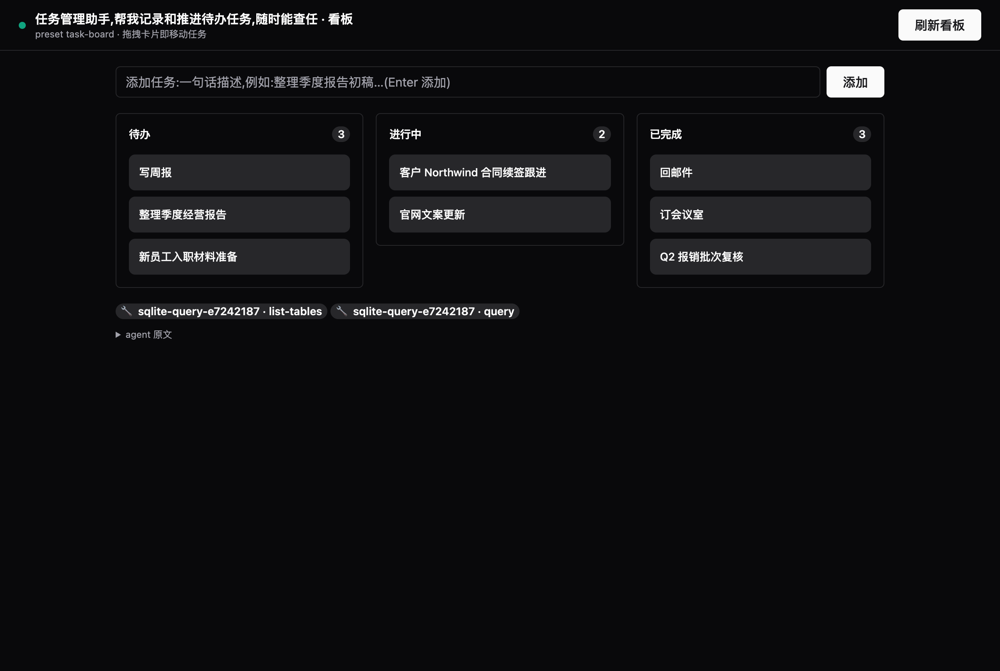
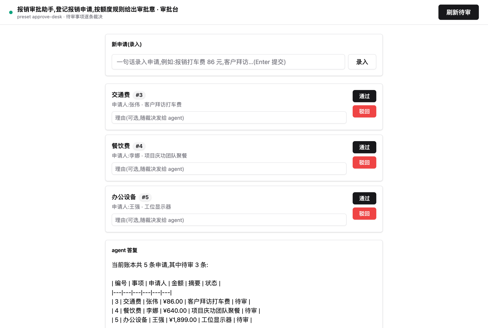
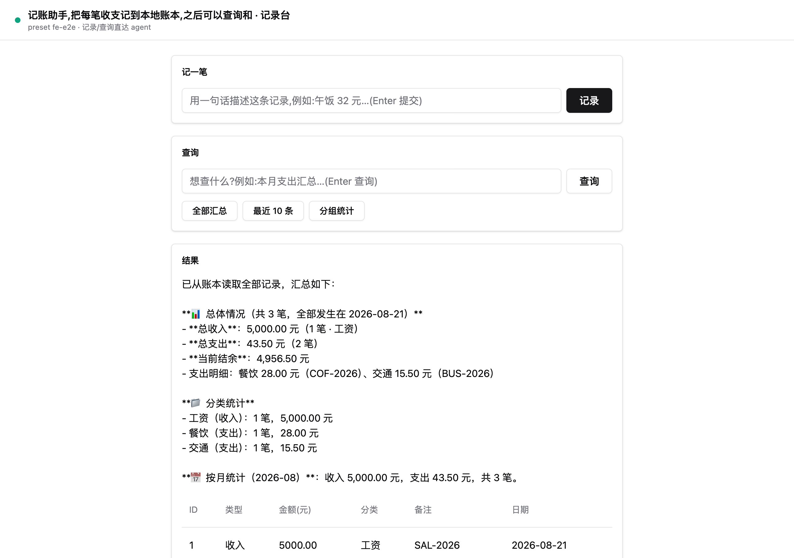
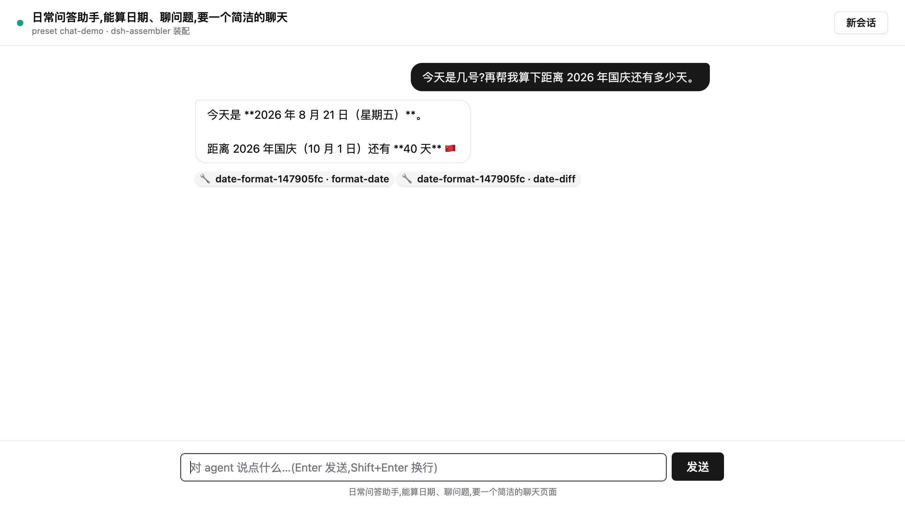

# dsh-assembler — Vibe Assembly for DSH

[English](README.md) | 中文

**把一句话需求装配成一个能干活的 AI agent,并且交得出去。**

`dsh-assembler` 是一个 DeepSeek Harness (DSH) 插件。用户用自然语言描述想要的 agent("帮我做一个能查订单、开工单、转人工的客服机器人"),装配器从**能力目录**匹配零件、发射 **agent preset**、然后**在真实会话里试跑验收**——新会话选中该 preset 即可使用。

能力目录由**索引流水线**自动生长:开源库、公开 API、客户自有接口、客户知识,都能一条命令收进目录,过质检门才入库。不写胶水代码,只写配置。

> **身份定位(2026-08-23,先实测后裁定):装配器 = 零件生态的搜索引擎**——它提供事实(BM25 加权的零件检索,带价签与实证战绩)、全闸门的确定性发射、独立黑盒考官、以及证据台账;**思考归你面前的主 agent**:架构、选型、persona/schema、重试决策全是它的。检索形态是**默认**(`DSH_ASSEMBLER_MODE` 不设即是);下文描述的一条龙管线降级为 `=pipeline` 显式开启的自动化后备。依据:四形态对跑,检索形态端到端**快 40%、装配器侧思考 114.5k→7.8k token、质量不掉**——详见 `docs/campaigns/forms-bcdf-8.md` 与 `docs/ROADMAP.md`。

---

## 现在的规模

| | 数字 | 证据 |
|---|---|---|
| 能力目录 | **84 个 MCP 服务器 / 229 个登记工具 / 83 个零件** | `index/catalog.yml`、`capabilities.yml` |
| 零件构成 | 62 库型 + 17 服务型 + 4 第一方 | `node scripts/catalog-report.mjs` |
| 装配耗时 | 单 agent 典型 **30–90 秒**;多 agent 方案约 5–10 分钟 | 各 preset 的 `progress.log` |
| 市场压测 | **84 个真实世界需求**分 4 批跑过——单 agent、复合 agent、对抗注入、多 agent FDE 班子 | `docs/campaigns/` |

---

## 特性

- **双入口**:`/assemble <需求>` 命令(人类快捷方式)+ `assemble` 工具(agent 原生路径,调用轨迹自动渲染)
- **装配即验证**:装配完成后自动派生验收探针,在绑定新 preset 的**真实会话**里试跑,按内容型验收标记判 PASS/FAIL;FAIL 触发一次带失败反馈的重新选型再探(find → assemble → **verify** 闭环)。探针快速且诚实:agent 中途向(不在场的)用户求助即判 FAIL 并带回问题原文,每一轮探针的工具动作实时上链
- **多轮场景探针**:派生器自行决定探针形态——纯计算需求出单轮题,跨轮需求(记账/归档/追踪)出 2-4 轮场景脚本,**同一会话**里逐轮验收,后面的轮次查询前面轮次写入的状态。全程黑盒:只看回复,不看轨迹
- **多 agent 方案(FDE 交付单元)**:`assemble` 装一个 agent;**`assemble_solution` 装一整套班子** + 一份交付说明书。给它 agent 清单,逐个走同一条验收流水线,再**从工件自己长出 `HANDOVER.md`**(每 agent 验收、共享表、待配凭证清单、供应链 BOM)。传一段 `sharedSchema`,每个 agent 的 SQLite 默认库都钉到**同一个方案共享库**——客服 agent 和对账 agent 读写**同一份**订单,是真的班子而非一堆散兵。(CLI `scripts/solution.mjs` 给不经 agent 的批处理交付用同一条流水线)
- **缺件工单**:选型报出目录尚不能覆盖的能力时,装配器把可执行工单写进 `<preset>/gaps/`:缺什么、造零件的真实入库命令、以及闭环的重跑命令。写缺失零件的活交给**调用方 agent**(它有全套 coding harness);装配脊柱保持确定性,验收永远归装配器自己的黑盒探针
- **装配直播台**:每次装配把行动链双写进 `<preset>/progress.log`;直播台页面(`/assembler/ui/_console`)轮询它,让慢装配变成一条可见的、带时间戳的轨迹——"卡了还是在干活"一眼可判,而不是一颗沉默的转圈 chip。选型、发射、探针轮次、每轮工具动作、20s 心跳都在那里滚动
- **方案包(FDE 交付单元)**:`solutions/<name>/solution.yml` 声明一次交付的全部——几个 agent、用哪份目录、部署参数、客户知识。`solution apply` 一条命令按清单装配并逐个验收;`solution handover` 从每个 preset 的 BOM **自动长出**交付报告。多租户 = 换 `--param` 换凭证,不分叉清单
- **知识包(`via: knowledge`)**:客户手册/SOP/产品目录作为**静态教材**进目录,过**检索命中门**(探针问题检不出预期片段就拒收),装配时**拷进 preset 的 `kb/`**——交付物自包含
- **凭证契约(接口先就位,key 后补)**:零件只**声明**需要哪个环境变量及用途,**值永不进 preset**;未配时零件照常启动、`listTools` 成功、调用返回**可行动错误**;装配侧对应为"装配成功 + 探针 SKIPPED + 配置指引"。可选凭证(如 GitHub 公开读)走匿名降级不拦验证
- **客户私有目录**:`catalogs/<client>/` 自带 `generated/`、`index/`、`capabilities.yml`——A 客户的零件**不会出现在** B 客户的装配里,隔离靠**分文件**而非过滤条件
- **服务型零件**:13 个实时数据服务已接入(天气/汇率/地理编码/节假日/宏观数据/美股财报/学术检索/维基事实/研究图谱/包情报…)。库型锁 `repo@rev`,服务型锁**条款 + 速率限制 + 数据许可**,同样进 BOM
- **零件物料清单(BOM)**:每次装配随 preset 发射 `parts.lock.yml`——每个零件的出处、许可、验证状态、实际挂载名、知识包来源版本、待配凭证清单
- **联邦索引缓存**:零件工具清单按(连接配置 + 适配器文件指纹)缓存,冷 ~5s → 热 **0.002s**
- **persona lint**:机械核查 persona(点名的工具必须在挂载面里、禁止"第 N 步"编舞句式、长度界)
- **设计文档**:[DESIGN.md](DESIGN.md)(中文)—— 装配器做什么、不做什么,以及边界在哪

---

## 装完即有前端:一键装配出带 Web UI 的 agent

装配不只发射 preset——每个 agent 同时得到一张**可直接操作的网页前端**,由装配器在 host 上同源伺服(`/assembler/ui/<preset>`)。页面直连 host 公开 wire(session.create / session.prompt / events.mux),与 DSH 对话页共用同一个 agent、同一个持久工作区;打开页面自动拉取当前状态。

下面每张图都是**一条 `/assemble` 命令的真实产物**(真实装配、真实数据、真实截图;判定行原样摘自装配结果):

> `任务管理助手,帮我记录和推进待办任务,要一个可以拖拽的任务看板页面` → 自动验证:PASS · 前端验收:页面门+环路门 PASS



> `报销审批助手,登记报销申请,按额度规则给出审批意见并留痕,要一个能通过驳回的审批页面`



> `记账助手,把每笔收支记到本地账本,之后可以查询和汇总,要一个能直接记账的网页页面`



> `日常问答助手,能算日期、聊问题,要一个简洁的聊天页面`



机制:

- **前端模板零件(`via: frontend`,第五种零件)**:7 张模板——聊天台(兜底,**每个 preset 默认自带**)、表单工单台、记录台、仪表盘、任务看板(拖拽)、审批台、文件台;选型器按交互形状恰选一张
- **观感**:基于 [Franken UI](https://github.com/franken-ui/ui)(shadcn/ui 的免构建 HTML 版,MIT),**本地 vendored**——离线/内网交付零 CDN 依赖;亮暗自适应
- **前后端契约**:页面在提问里自带 ```json 围栏契约(不依赖 persona),agent 回复即渲染成看板/表格/指标卡
- **前端也过验收**:装配即验证新增两道前端门——**页面可达门**(HTTP 200 + 槽位完整)与**会话环路门**(按页面同款参数真开会话打一轮口令回显);沿用轮只重页面门
- **持久同库**:装备槽为状态零件钉死默认数据库(工作区 `data.db`)并预建表结构,前端会话与 DSH 对话会话写**同一份账**——关页重开,数据仍在

---

## 架构

```
┌───────── 索引流水线(供应链) ──────────────────────────────────────────┐
│ 开源库 / 公开 API / 客户接口 spec / 客户知识                            │
│   → 切能力点 → MCP 适配 → 质检门(冒烟 / 检索命中)→ 入目录             │
└─────────────────────────────────────────────────────────────────────────┘
                              ↓
┌───────── 装配(能力消费) ─────────────────────────────────────────────┐
│ capabilities.yml(公共或客户目录) + 并行联邦 → LLM 选型                │
│   → 发射 preset + BOM + 知识包拷入 kb/                                  │
│   → 自动验证:派生探针(单轮或多轮场景)→ 真实会话试跑 → PASS/FAIL     │
└─────────────────────────────────────────────────────────────────────────┘
                              ↓
┌───────── 交付(FDE) ─────────────────────────────────────────────────┐
│ solution apply(按清单装配全部 agent)                                  │
│   → solution handover:交付报告(验收/参数/待配凭证/知识/BOM/重建命令) │
└─────────────────────────────────────────────────────────────────────────┘
                              ↓
┌───────── 运行时(harness 的领土) ────────────────────────────────────┐
│ 新会话选中 preset → DSH 按行挂载插件 → agent 真实调用零件工具          │
└─────────────────────────────────────────────────────────────────────────┘
```

装配器是 Cordis 插件,产物是 Cordis 插件组合清单(preset 每行 = 一个插件实例);零件是外部 MCP 服务器进程,通过 `@deepseek-ai/dsh-mcp-client` 桥接。**装配器只在装配时存在**——会话跑起来后它的进程死掉,一切照常。

---

## 快速开始

### 1. 安装

加入 DSH profile 的 patch 层(示例 `~/.dsh/profiles/web/cordis.patch.yml`):

```yaml
- insert:
    - id: dsh-assembler
      name: '@dsh-external/dsh-assembler'
```

`package.json` 依赖:`"@dsh-external/dsh-assembler": "link:/path/to/dsh-assembler"`。

服务型零件若需部署方联系方式(SEC 强制 UA、Crossref/OpenAlex polite pool),复制 `.env.example` 为 `.env` 并填自己的邮箱——**不是凭证,但也不该硬编码任何人的地址**。

### 2. 装配一个 agent

```
/assemble 帮我组装一个客服机器人,能查客户信息、创建工单、转人工 [--name customer-service-bot] [--param timezone=Asia/Shanghai]
```

或直接在任意会话里说"帮我组装一个能查订单、开工单、转人工的客服机器人"——agent 会自动调用 `assemble` 工具,思维链 + 工具卡片 + 结果全部渲染。

### 3. 交付一整套班子(FDE 路径)

直接在会话里要一套 agent——"给我一套运营 agent 班子:客服、对账、库存、内容四个,共享同一套商品/订单数据,各有前端,再给我一份交付说明书"——agent 会自动调用 **`assemble_solution`**:把需求拆成分工明确的 agent、逐个装配并验收、钉到同一个共享库、写出 `HANDOVER.md`。无清单要手改。

不经 agent 的批处理交付,用 CLI 走同一条流水线:

```bash
npm run solution -- init acme-service --client acme     # 起清单
# 编辑 solutions/acme-service/solution.yml 的 agents
npm run solution -- apply solutions/acme-service/solution.yml --port 3096
npm run solution -- handover solutions/acme-service/solution.yml
```

产出 `HANDOVER.md`:交付了哪些 agent 与验收结论、共享表、部署参数、**待配凭证清单**、知识包来源版本、供应链 BOM、重建命令。全部从工件里长出来,**没有一处靠人填写**。

---

## 目录结构

```
dsh-assembler/
├── src/
│   ├── index.ts            # 装配核心:目录加载/选型/发射/BOM/参数/凭证/知识
│   ├── verify.ts           # 装配即验证:探针派生(单轮/多轮场景)+ 真实会话驱动
│   ├── persona-lint.ts     # persona 机械核查
│   └── assemble-tool.ts    # assemble agent 工具定义
├── capabilities.yml        # ★ 公共组装目录:能力条目 + mcp-servers + requiredSecrets
├── index/                  # ★ 公共零件索引(出处/许可/条款)+ 冒烟报告
├── generated/              # ★ 零件库:78 个 MCP 适配服务器(每零件一目录)
├── catalogs/<client>/      # ★ 客户私有目录:自带 generated/ index/ capabilities.yml knowledge/
├── solutions/<name>/       # ★ 方案包:solution.yml + last-apply.json + HANDOVER.md
├── bench/results/          # 装配质量基准账本(run-tagged,git 收录)
├── presets/
│   └── agent-template.yml  # preset 模板({{persona}}/{{packageRows}}/{{extraRows}}/{{param:k}})
└── scripts/
    ├── index-add.mjs       # ★ 索引流水线 CLI
    ├── solution.mjs        # ★ 方案包 CLI
    ├── assembly-bench.mjs  # 45 题装配质量基准
    └── link-dsh.mjs        # 链接 DSH peer 包
```

---

## 能力目录

四种能力来源:

| `via` | 来源 | 例子 |
|---|---|---|
| `package` | 本仓库/自有插件包的工具 | `crm-query` |
| `harness` | DSH 内置工具 | `content-search` |
| `mcp` | MCP 服务器工具(装配时自动联邦) | `mcp-weather-forecast-current-weather` 等 229 条 |
| `knowledge` | 客户静态教材(装配时拷入 `kb/`) | `acme-policies-kb` |

**78 个零件 / 215 个工具** —— 61 库型、13 服务型、4 第一方。

### 服务型零件 —— 实时数据与外部系统

| 零件 | 工具 | 数据源 | 许可/条款 | 凭证 |
|---|---|---|---|---|
| **package-registry** | `package-info` `package-versions` `check-license` | npm + PyPI registries | registry ToS | 免 |
| **weather-forecast** | `current-weather` `daily-forecast` | Open-Meteo | CC-BY-4.0 | 免 |
| **currency-rates** | `latest-rates` `historical-rate` `convert-amount` | Frankfurter (ECB data) | Public-Domain-ECB | 免 |
| **geocode** | `geocode-address` `reverse-geocode` | OpenStreetMap Nominatim | ODbL-1.0 | 免 |
| **public-holidays** | `list-holidays` `is-workday` `available-countries` | Nager.Date | MIT | 免 |
| **worldbank-data** | `country-indicator` `common-indicators` | World Bank Open Data | CC-BY-4.0 | 免 |
| **sec-filings** | `lookup-cik` `company-filings` | U.S. SEC EDGAR | Public-Domain-US-Gov | 免 |
| **scholar-search** | `search-published` `search-preprints` `doi-lookup` | Crossref + arXiv | CC0-1.0 / arXiv terms | 免 |
| **wiki-facts** | `page-summary` `search-entity` `entity-facts` | Wikimedia (Wikipedia + Wikidata) | CC-BY-SA-4.0 | 免 |
| **research-graph** | `search-works` `work-citations` `author-works` | OpenAlex | CC0-1.0 | 免 |
| **feishu-messaging** | `send-message` `list-chats` `feishu-capabilities` | 飞书开放平台 | Feishu API ToS | `FEISHU_APP_ID` `FEISHU_APP_SECRET` |
| **slack-messaging** | `post-message` `list-channels` `slack-capabilities` | Slack API | Slack API ToS | `SLACK_BOT_TOKEN` |
| **github-issues** | `list-issues` `get-issue` `create-issue` `github-capabilities` | GitHub REST API | GitHub ToS | `GITHUB_TOKEN`(可选) |

### 第一方零件 —— Node 内置薄壳,零第三方依赖

`binary-write`(write-binary-file) · `crypto-hash`(hash-text, hmac-sign, generate-uuid) · `compress-gzip`(compress, decompress) · `dns-lookup`(resolve-domain, reverse-lookup)

### 库型零件(按领域)

| 领域 | 零件(工具数) |
|---|---|
| **文档办公** | `pdf-generate`(4) · `pdf-extract`(3) · `pdf-report`(1) · `docx-generate`(3) · `docx-extract`(2) · `pptx-generate`(1) · `excel-read-write`(4) · `zip-archive`(4) |
| **数据格式** | `csv-parse`(3) · `yaml-convert`(2) · `toml-parse`(2) · `xml-parse`(3) · `json-query`(2) · `json-schema-validate`(2) · `html-parse`(4) · `html-to-text`(4) |
| **文本处理** | `markdown-render`(3) · `html-to-markdown`(1) · `readability-extract`(2) · `text-diff`(3) · `template-render`(4) · `fuzzy-search`(4) · `text-encoding`(2) |
| **中文专项** | `pinyin-convert`(2) · `chinese-convert`(2) · `word-segment`(2) · `num-to-chinese`(2) |
| **计算** | `math-eval`(2) · `currency-calc`(4) · `number-format`(4) · `semver-check`(3) · `geo-distance`(3) · `color-convert`(2) |
| **时间日历** | `date-format`(4) · `cron-parse`(2) · `calendar-parse`(3) · `calendar-generate`(4) · `rrule-expand`(2) |
| **数据库** | `sqlite-query`(3) · `mysql-query`(4) · `postgres-query`(4) |
| **网络通信** | `http-request`(4) · `email-send`(4) · `email-fetch`(4) · `rss-parse`(4) |
| **媒体识别** | `image-process`(4) · `ocr-parse`(3) · `qrcode-generate`(4) · `barcode-generate`(2) · `exif-read`(1) · `file-type-detect`(1) |
| **安全校验** | `jwt-decode`(2) · `ip-utils`(2) · `string-validate`(2) · `fake-data`(2) · `phone-parse`(2) |
| **工程工具** | `github-api`(4) · `browser-automate`(4) · `url-slugify`(3) · `transliterate`(2) · `safe-filename`(2) |

<details>
<summary><b>完整工具级清单</b></summary>

- **email-send** — `send-email`, `verify-smtp-config`, `parse-email-addresses`, `create-test-account`
  <br/><sub>nodemailer/nodemailer@v6.9.13 · MIT</sub>
- **email-fetch** — `list-mailboxes`, `search-messages`, `fetch-message`, `list-message-summaries`
  <br/><sub>postalsys/imapflow@v1.0.162 · MIT</sub>
- **http-request** — `http-request`, `http-get`, `http-post`, `build-url`
  <br/><sub>axios/axios@v1.7.2 · MIT</sub>
- **html-parse** — `extract-text`, `extract-attributes`, `query-elements`, `serialize-html`
  <br/><sub>cheeriojs/cheerio@v1.0.0-rc.12 · MIT</sub>
- **csv-parse** — `parse-csv`, `unparse-csv`, `validate-csv`
  <br/><sub>papaparse/papaparse@5.4.1 · MIT</sub>
- **pdf-generate** — `create-pdf`, `merge-pdfs`, `extract-pages`, `pdf-info`
  <br/><sub>Hopding/pdf-lib@v1.17.1 · MIT</sub>
- **date-format** — `format-date`, `parse-date`, `date-diff`, `date-manipulate`
  <br/><sub>iamkun/dayjs@v1.11.11 · MIT</sub>
- **sqlite-query** — `query`, `execute`, `list-tables`
  <br/><sub>WiseLibs/better-sqlite3@v11.1.2 · MIT</sub>
- **github-api** — `get-user`, `get-repo`, `list-org-repos`, `search-repositories`
  <br/><sub>octokit/rest.js@v20.1.1 · MIT</sub>
- **markdown-render** — `render-markdown`, `render-markdown-inline`, `tokenize-markdown`
  <br/><sub>markedjs/marked@v12.0.2 · MIT</sub>
- **pdf-extract** — `get-pdf-text`, `get-pdf-info`, `search-pdf-text`
  <br/><sub>pdf-parse/pdf-parse@1.1.1 · MIT</sub>
- **excel-read-write** — `read-xlsx-file`, `write-xlsx-file`, `read-csv-file`, `write-csv-file`
  <br/><sub>exceljs/exceljs@v4.4.0 · MIT</sub>
- **docx-generate** — `docx-generate-text`, `docx-generate-table`, `docx-patch-document`
  <br/><sub>dolanmiu/docx@8.5.0 · MIT</sub>
- **zip-archive** — `zip-list-entries`, `zip-read-file`, `zip-create-archive`, `zip-update-archive`
  <br/><sub>cthackers/adm-zip@v0.5.12 · MIT</sub>
- **fuzzy-search** — `fuzzy-search`, `fuse-create-index`, `fuse-search-with-index`, `fuse-config`
  <br/><sub>krisk/Fuse@v7.0.0 · Apache-2.0</sub>
- **template-render** — `render-template`, `precompile-template`, `render-precompiled`, `validate-template`
  <br/><sub>handlebars-lang/handlebars.js@v4.7.8 · MIT</sub>
- **html-to-text** — `html-to-text`, `html-to-text-batch`, `html-to-text-table`, `html-to-text-links`
  <br/><sub>html-to-text/node-html-to-text@9.0.5 · MIT</sub>
- **xml-parse** — `xml-validate`, `xml-parse`, `xml-build`
  <br/><sub>NaturalIntelligence/fast-xml-parser@v4.4.0 · MIT</sub>
- **image-process** — `image-info`, `image-resize`, `image-convert`, `image-thumbnail`
  <br/><sub>lovell/sharp@v0.33.4 · Apache-2.0</sub>
- **rss-parse** — `parse-rss-string`, `parse-rss-url`, `extract-feed-items`, `parse-feed-metadata`
  <br/><sub>rbren/rss-parser@v3.13.0 · MIT</sub>
- **calendar-parse** — `parse-ics`, `parse-ics-file`, `fetch-ics-url`
  <br/><sub>jens-maus/node-ical@0.19.0 · Apache-2.0</sub>
- **calendar-generate** — `create-calendar`, `create-event`, `create-all-day-event`, `create-recurring-event`
  <br/><sub>sebbo2002/ical-generator@v7.1.0 · MIT</sub>
- **mysql-query** — `mysql-query`, `mysql-list-tables`, `mysql-describe-table`, `mysql-test-connection`
  <br/><sub>sidorares/node-mysql2@v3.10.0 · MIT</sub>
- **number-format** — `format-number`, `unformat-number`, `arithmetic`, `validate-number`
  <br/><sub>adamwdraper/Numeral-js@2.0.6 · MIT</sub>
- **qrcode-generate** — `qr-generate-png`, `qr-generate-data-url`, `qr-generate-svg`, `qr-generate-terminal`
  <br/><sub>soldair/node-qrcode@v1.5.3 · MIT</sub>
- **postgres-query** — `postgres-test-connection`, `postgres-list-tables`, `postgres-describe-table`, `postgres-query`
  <br/><sub>brianc/node-postgres@pg@8.12.0 · MIT</sub>
- **browser-automate** — `browser-open`, `browser-extract`, `browser-click`, `browser-screenshot`
  <br/><sub>microsoft/playwright@v1.45.0 · Apache-2.0</sub>
- **ocr-parse** — `ocr-languages`, `ocr-psm-modes`, `ocr-recognize`
  <br/><sub>naptha/tesseract.js@v5.1.0 · Apache-2.0</sub>
- **currency-calc** — `currency-calc`, `currency-format`, `currency-distribute`, `currency-parse`
  <br/><sub>scurker/currency.js@v2.0.4 · MIT</sub>
- **readability-extract** — `extract-article`, `extract-batch`
  <br/><sub>mozilla/readability@0.5.0 · MIT</sub>
- **pdf-report** — `create-report-pdf`
  <br/><sub>Hopding/pdf-lib@v1.17.1 · MIT</sub>
- **binary-write** — `write-binary-file`
  <br/><sub>first-party@- · BSD-3-Clause</sub>
- **text-diff** — `create-patch`, `apply-patch`, `diff-words`
  <br/><sub>kpdecker/jsdiff@v9.0.0 · BSD-3-Clause</sub>
- **crypto-hash** — `hash-text`, `hmac-sign`, `generate-uuid`
  <br/><sub>first-party@v- · BSD-3-Clause</sub>
- **math-eval** — `evaluate`, `unit-convert`
  <br/><sub>josdejong/mathjs@v15.2.0 · Apache-2.0</sub>
- **cron-parse** — `next-runs`, `describe-fields`
  <br/><sub>harrisiirak/cron-parser@v5.10.0 · MIT</sub>
- **semver-check** — `compare`, `satisfies`, `coerce-valid`
  <br/><sub>npm/node-semver@v7.8.5 · ISC</sub>
- **yaml-convert** — `yaml-to-json`, `json-to-yaml`
  <br/><sub>eemeli/yaml@v2.9.0 · ISC</sub>
- **pinyin-convert** — `to-pinyin`, `multi-tone`
  <br/><sub>zh-lx/pinyin-pro@v3.29.2 · MIT</sub>
- **chinese-convert** — `s2t`, `t2s`
  <br/><sub>nk2028/opencc-js@v1.4.1 · MIT AND Apache-2.0</sub>
- **html-to-markdown** — `html-to-markdown`
  <br/><sub>mixmark-io/turndown@v7.2.4 · MIT</sub>
- **text-encoding** — `decode-base64`, `encode-to-base64`
  <br/><sub>ashtuchkin/iconv-lite@v0.7.3 · MIT</sub>
- **phone-parse** — `parse-phone`, `format-phone`
  <br/><sub>catamphetamine/libphonenumber-js@v1.13.11 · MIT</sub>
- **compress-gzip** — `compress`, `decompress`
  <br/><sub>first-party@v- · BSD-3-Clause</sub>
- **dns-lookup** — `resolve-domain`, `reverse-lookup`
  <br/><sub>first-party@v- · BSD-3-Clause</sub>
- **json-query** — `query`, `query-multi`
  <br/><sub>jmespath/jmespath.js@v0.16.0 · Apache-2.0</sub>
- **json-schema-validate** — `validate`, `check-schema`
  <br/><sub>ajv-validator/ajv@v8.20.0 · MIT</sub>
- **toml-parse** — `toml-to-json`, `json-to-toml`
  <br/><sub>squirrelchat/smol-toml@v1.8.0 · BSD-3-Clause</sub>
- **docx-extract** — `docx-to-text`, `docx-to-html`
  <br/><sub>mwilliamson/mammoth.js@v1.12.1 · BSD-2-Clause</sub>
- **pptx-generate** — `create-pptx`
  <br/><sub>gitbrent/pptxgenjs@v4.0.1 · MIT</sub>
- **barcode-generate** — `barcode-png`, `barcode-types`
  <br/><sub>metafloor/bwip-js@v4.11.2 · MIT</sub>
- **string-validate** — `validate-string`, `sanitize-string`
  <br/><sub>validatorjs/validator.js@v13.15.35 · MIT</sub>
- **fake-data** — `fake-records`, `fake-text`
  <br/><sub>faker-js/faker@v10.6.0 · MIT</sub>
- **num-to-chinese** — `to-chinese`, `from-chinese`
  <br/><sub>cnwhy/nzh@v1.0.14 · BSD-2-Clause</sub>
- **jwt-decode** — `decode-jwt`, `verify-jwt-hs256`
  <br/><sub>panva/jose@v6.2.9 · MIT</sub>
- **ip-utils** — `parse-ip`, `cidr-match`
  <br/><sub>whitequark/ipaddr.js@v2.5.0 · MIT</sub>
- **transliterate** — `transliterate-text`, `make-slug`
  <br/><sub>dzcpy/transliteration@v2.6.1 · MIT</sub>
- **rrule-expand** — `expand-rrule`, `describe-rrule`
  <br/><sub>jkbrzt/rrule@v2.8.1 · BSD-3-Clause</sub>
- **exif-read** — `read-exif`
  <br/><sub>MikeKovarik/exifr@v7.1.3 · MIT</sub>
- **file-type-detect** — `detect-file-type`
  <br/><sub>sindresorhus/file-type@v22.0.2 · MIT</sub>
- **color-convert** — `convert-color`, `contrast-check`
  <br/><sub>Evercoder/culori@v4.0.2 · MIT</sub>
- **word-segment** — `segment-text`, `extract-keywords`
  <br/><sub>linonetwo/segmentit@v2.0.3 · MIT</sub>
- **geo-distance** — `distance`, `bearing`, `center-and-bounds`
  <br/><sub>manuelbieh/geolib@v3.3.14 · MIT</sub>
- **url-slugify** — `slugify`, `slugify-unique`, `slugify-custom`
  <br/><sub>sindresorhus/slugify@v3.0.0 · MIT</sub>
- **safe-filename** — `sanitize`, `sanitize-path`
  <br/><sub>sindresorhus/filenamify@v7.0.2 · MIT</sub>
- **package-registry** — `package-info`, `package-versions`, `check-license`
  <br/><sub>https://registry.npmjs.org · registry ToS</sub>
- **weather-forecast** — `current-weather`, `daily-forecast`
  <br/><sub>https://api.open-meteo.com/v1 · CC-BY-4.0</sub>
- **currency-rates** — `latest-rates`, `historical-rate`, `convert-amount`
  <br/><sub>https://api.frankfurter.dev/v1 · Public-Domain-ECB</sub>
- **geocode** — `geocode-address`, `reverse-geocode`
  <br/><sub>https://nominatim.openstreetmap.org · ODbL-1.0</sub>
- **public-holidays** — `list-holidays`, `is-workday`, `available-countries`
  <br/><sub>https://date.nager.at/api/v3 · MIT</sub>
- **worldbank-data** — `country-indicator`, `common-indicators`
  <br/><sub>https://api.worldbank.org/v2 · CC-BY-4.0</sub>
- **sec-filings** — `lookup-cik`, `company-filings`
  <br/><sub>https://data.sec.gov · Public-Domain-US-Gov</sub>
- **scholar-search** — `search-published`, `search-preprints`, `doi-lookup`
  <br/><sub>https://api.crossref.org · CC0-1.0 / arXiv terms</sub>
- **wiki-facts** — `page-summary`, `search-entity`, `entity-facts`
  <br/><sub>https://en.wikipedia.org/api/rest_v1 · CC-BY-SA-4.0</sub>
- **research-graph** — `search-works`, `work-citations`, `author-works`
  <br/><sub>https://api.openalex.org · CC0-1.0</sub>
- **feishu-messaging** — `send-message`, `list-chats`, `feishu-capabilities`
  <br/><sub>https://open.feishu.cn/open-apis · Feishu API ToS</sub>
- **slack-messaging** — `post-message`, `list-channels`, `slack-capabilities`
  <br/><sub>https://slack.com/api · Slack API ToS</sub>
- **github-issues** — `list-issues`, `get-issue`, `create-issue`, `github-capabilities`
  <br/><sub>https://api.github.com · GitHub ToS</sub>

</details>

### 许可证

**所包装代码**(库型 + 第一方零件):MIT 46 · Apache-2.0 7 · BSD-3-Clause 7 · ISC 2 · BSD-2-Clause 2 · MIT AND Apache-2.0 1

**数据许可 / 服务条款**(服务型零件):CC-BY-4.0 2 · registry ToS 1 · Public-Domain-ECB 1 · ODbL-1.0 1 · MIT 1 · Public-Domain-US-Gov 1 · CC0-1.0 / arXiv terms 1 · CC-BY-SA-4.0 1 · CC0-1.0 1 · Feishu API ToS 1 · Slack API ToS 1 · GitHub ToS 1

全部宽松许可,代码侧零 copyleft 风险。服务型零件另记**数据许可**——那是另一种义务:Nominatim 是 ODbL、Wikipedia 是 CC-BY-SA(署名/共享要求),因此逐条记录并随装配进入 BOM。

完整机器可读清单(含每个零件的 `repo@rev`、许可、条款、速率限制与工具描述):[`index/catalog.yml`](index/catalog.yml)。

---

## 索引流水线(收录 CLI)

设计前提是**调用方就是 agent**:CLI 只做确定性环节(取源、出工单、装依赖、质检、登记),"切能力点 + 写适配代码"留给调用方。每个子命令末行输出 JSON 判定,机器可判读。

```bash
# 收开源库
npm run index:add -- kpdecker/jsdiff --pkg diff --id text-diff
npm run index:verify -- text-diff        # install → 冒烟(exit 0 必须)→ 独立 listTools → 报告
npm run index:register -- text-diff      # 幂等登记;下次装配联邦自动看见

# 收公开 API(锁条款/速率/数据许可,而非版本)
node scripts/index-add.mjs scaffold - --service https://api.open-meteo.com/v1 --id weather-forecast \
  --provider 'Open-Meteo' --license CC-BY-4.0 --terms https://open-meteo.com/en/terms --rate-limit '免费非商用无限制'

# 接客户系统(FDE 日常):吃 OpenAPI → 端点清单工单 → 客户私有目录
node scripts/index-add.mjs from-spec <spec-url|file> --id <id> --client acme \
  --requires-secret "TOKEN:用途说明,可含逗号;OTHER:第二个"

# 收客户知识(过检索命中门)
node scripts/index-add.mjs knowledge <文档目录> --id acme-policies --client acme --version 2026-08
# 写 probes.json(问题 + 预期片段)后:
node scripts/index-add.mjs knowledge-verify acme-policies --client acme

# 全自动:一条命令收录(需要在跑的 web profile)
npm run index:auto -- sindresorhus/slugify --pkg @sindresorhus/slugify --id url-slugify

npm run index:check     # 全量回归:跑每个零件的冒烟(离线时网络零件记 SKIPPED 并单独计数)
node scripts/index-add.mjs coverage   # 能力覆盖图:语义判重用
```

**质检门在流水线里**:verify 不过,register 直接拒绝。**去重两层**——机械硬门(同 id / 同 npm 包 / 同上游 repo),以及对着 `coverage` 覆盖图做能力级判重:目录收的是能力点,不是库。

---

## 输出示例

### 装配即验证(多轮场景)

需求"记账助手,把每笔收支记到本地账本,之后可以查询和汇总"——派生器判定这是跨轮任务,出了一个 3 轮场景:

```
自动验证:PASS — 多轮场景「证明记账助手能把收支持久化到 SQLite,并在后续轮次中查询和汇总」共 3 轮,逐轮通过
  第1轮 ✓ 「记一笔收入:项目款 8899 元,备注 INV-7781…」标记 [INV-7781, 8899]
  第2轮 ✓ 「再记一笔支出:办公用品 1200 元,备注 OFFICE-2201…」标记 [OFFICE-2201, 1200]
  第3轮 ✓ 「查询本地账本,列出所有记录并汇总收支」标记 [INV-7781, OFFICE-2201, 8899]
```

第 3 轮查的是前两轮写入的状态——这样验收才能证明状态真的活过了轮次。纯计算类需求则只出单轮题。

### 凭证的四种状态

```
# 缺必需凭证:装配成功,探针 SKIPPED,给出配置指引
自动验证:跳过(待配置凭证:SLACK_BOT_TOKEN——装配正确但无法实调外部服务,配好后重跑装配即可验证)
所需凭证:SLACK_BOT_TOKEN(待配置) — Slack Bot User OAuth Token(xoxb- 开头)

# 可选凭证:走匿名路径照常验证通过
自动验证:PASS — 探针「对公开仓库 octocat/Hello-World 做一次巡检…」通过
所需凭证:GITHUB_TOKEN(可选,未配则降级)
```

### 零件物料清单 `parts.lock.yml`(节选)

```yaml
preset: currency-qr-assistant
parts:
  - capability: mcp-qrcode-generate-qr-generate-png
    server: qrcode-generate
    serverName: qrcode-generate-d0fb25cc   # 从 preset 字节读回,永远与实际挂载一致
    repo: soldair/node-qrcode
    rev: v1.5.3
    license: MIT
    verified: true
  - capability: mcp-weather-forecast-current-weather
    kind: service
    service: https://api.open-meteo.com/v1
    terms: https://open-meteo.com/en/terms
    rateLimit: 免费非商用无限制;商用需订阅
knowledge:
  - id: acme-policies
    docs: 2
    source: ACME 客服中心知识库导出
    version: 2026-08
```

---

## 开发

```bash
npm run link:dsh   # 链接 DSH peer 包(需要 DSH_SOURCE 或 ~/.dsh/source/current)
npm run build      # tsc 构建到 lib/
npm test           # 构建 + 三套单测(命名代际不变式 / 验收判定与 BOM / 联邦缓存)
npm run index:check   # 全量零件冒烟回归
npm run bench      # 45 题装配基准
```

改 `lib/` 后需重启 DSH web 进程生效;改 `capabilities.yml` 无需重启(装配时实时读取)。

写网络零件时的两个环境事实:Node 的 `fetch` 忽略 `HTTP(S)_PROXY`,除非设了 `NODE_USE_ENV_PROXY=1`;MCP SDK 的 `StdioClientTransport` **只透传白名单环境变量**,代理设置不会自动进入零件进程。流水线已统一处理这两点,手写冒烟时需要自己把环境传下去。

---

## 许可证

BSD-3-Clause。零件适配的上游库许可证见 `index/catalog.yml` 各条目;服务型零件的数据许可与条款同样逐条记录在目录条目里。
